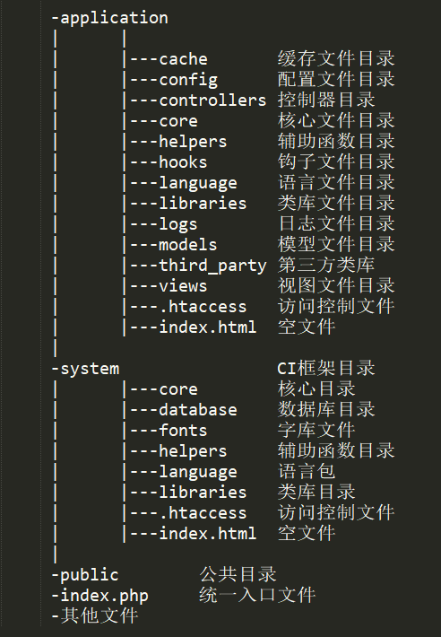

# CI CodeIgniter3

框架的一些不足之处

1. 方法名是用下划线，而不是驼峰式命名

2. 选择表方法是`form()`，而不是`table()`

3. 每次查询操作都要以`result()`结尾

4. 自动加载不彻底，有时候需要用`$this->load->xxx()`

5. 对模块没有原生支持

6. 不自带模板，需要手动集成(如smarty等)

## 1. 核心代码

### 1.1 目录

CI的目录结构如下：

{:height="420px" width="300px"}

### 1.2 单一入口

目前的框架几乎都会使用统一入口，被命名为`index.php`(也有`server.php`)。它可以做到统一管理，保证对外有一致的处理流程。
入口文件的主要目的是做一些简单的处理：

> 1. 设置当前运行环境(开发、测试、线上)
> 2. 检测对应的目录是否存在
> 3. 设置常量

框架实际运行流程在`system/core/Codeigniter.php`中执行

## 1.3 引导文件

引导文件(CodeIgiter.php)，类似`main()`函数，代表一次完整的请求执行流程。`index.php`把流程交给它后，引导文件会负责实例化比较重要的类，然后执行特定功能。
当然，在这个文件里，我们可以看到哪个类是什么时候初始化的，调用了什么方法，还可以看到哪些钩子在什么时候被调用。

> 1. 系统初始化文件
> 2. 定义CI版本
> 3. 加载框架常量
> 4. 加载全局函数
> 5. 安全处理(php 5.4 以后删除了`magic_quotes`特性)
> 6. 定制自己的错误处理函数
> 7. 设置子类前缀
> 8. 是否启用 composer 自动加载机制
> 9. 设置时间
> 10. 实例化钩子类
> 11. 检测`pre_system`钩子
> 12. 实例化配置类
> 13. 设置字符集相关内容
> 14. 加载兼容库
> 15. 实例化类：UTF8, URI, Route, Output
> 16. 检测是否有缓存
> 17. 加载类：Security, Input, Lang, Controller
> 18. 开启性能测试
> 19. 404错误处理
> 20. 实例化请求控制器
> 21. 调用`post_controller_constructor`钩子
> 22. 调用请求方法
> 23. 检测`post_controller`, `display_override`, `post_system`钩子

## 1.4 URI类

URI类用来解析URI并确定路由。负责通过url中的数据来获取路径的对应关系。有`xxx?xx=xx&xx=xx`和`xxx/xx/xx`两种方式。
然后交由Router类负责根据路径确定调用哪个控制器的哪个方法。
在URI中，成员属性中如果没有r，则表示原始信息；带有r，则表示是经过Router类设置的。
对于URI处理来说，常见的操作是过滤非法字符，处理斜线(/)，还实现了URI和关联数组的转换。

### URL类内部变量

`$keyval`
`$uri_string`
`$segments`
`$rsegments`
`$_permitted_uri_chars`

`_set_uri_string()`
设置URI字符串

（待添加类函数）

## 1.5 Router类

该类主要根据得到的URI字段来获取对应的路由信息，还包括路由的定制信息，来得到想要的目录名、类名、方法名

（待添加）

## 1.6 Config类

该类统一管理配置选项，它提供了对单个配置项的处理。
提供的主要功能就是读写配置，也支持加载特定的配置文件，

（待添加）

## 1.7 Log类

当服务在线上运行时，记录日志是非常重要的，可以通过分析日志来还原当时情景，查找分析存在漏洞。
在CI框架中，就是通过该类来实现日志记录的。其主要方法为`write_log()`，也可以通过`log_message()`来进行日志写入

（待添加）

## 1.8 Input类

该类用于统一处理输入数据。包括`$_POST`，`$_GET`，`$_COOKIE`，`$_SERVER`，`php://input`，另外还有IP地址。
Input类与Security类和Utf8类息息相关，因为在输入数据的时候需要进行安全过滤和对相应的字符集的处理。

（待添加）

## 1.9 Security类

该类负责管理安全方面内容。主要处理`XSS`和`CSRF`安全问题。对于`CSRF`通常采取添加token，对于`XSS`则需要用正则进行数据过滤了

（待添加）

## 1.10 Output类

输出类，主要处理三个部分内容：

1. 处理头部信息

2. 处理具体内容

3. 控制缓存

（待添加）

## 1.11 Loader类

加载类，负责加载视图、模型、helper、libraries等等
通过这个类我们可以学习到，CI是如何处理加载问题的，从哪里加载？加载之后如何实例化？如何自动加载？

（待添加）

## 1.12 Hook类

钩子类，预先设置了一些钩子，同时方便我们进行功能扩展

（待添加）

## 1.13 BM类

基准测试类。对于框架，我们要知道它运行时的性能问题。
常见的性能问题：

1. CPU占用

2. 内存占用

3. IO占用

4. 执行耗时

该类主要支持了执行耗时和内存占用这两点

（待添加）

## 1.14 Controller类

控制器类，这个类是我们所有控制器的基类，在其构造函数内，很多实例化对象都作为了它的属性，因此可以使用`$this->xxx`来获取各种需要的类对象

（待添加）

## 1.15 Model类

模型类，所有模型的基类，该类只有构造函数和`__get()`魔术方法

（待添加）

## 1.16 Exception类

异常处理类，处理一系列异常问题

（待添加）

## 1.17 Lang类

语言类，提供两个功能，加载语言包和获取一个语言项

# 2 数据库

对于web应用，多数操作是围绕数据库进行的（增删改查）。
`DB`为数据库对象，`DB_cache`用于对数据结果进行缓存，`DB_driver`提供了一个对具体的数据库的抽象，`DB_forge`进行结构的创建，`DB_query_builder`是对sql的构建，`DB_result`是对结果集的分析，`DB_utility`是一些数据库方面的工具。

## 2.1 DB

## 2.2 Cache

## 2.3 Driver

## 2.4 Forge

## 2.5 QueryBuilder

## 2.6 Result

## 2.7 Utility
