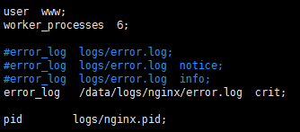
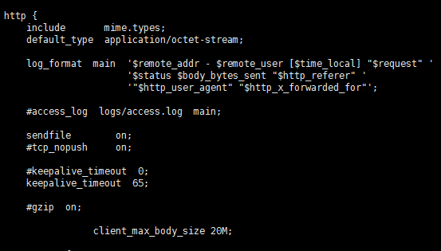
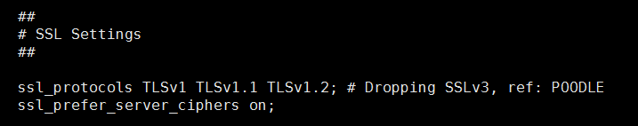
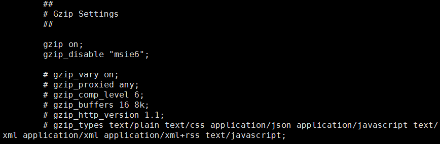

# Nginx

## 1. 核心概念

### 1.1 介绍

Nginx的创始人是俄罗斯工程师 Igor Sysoev，其最初目的是为俄罗斯的搜索引擎Rambler使用，所以十分注重并发能力。
Nginx是一个__高性能的http服务器和反向代理服务器，同时也是邮件服务器__。遵循BSD开源协议。Nginx最大的优点是__内存占用小，并发能力强__。

### 1.2 核心配置

Nginx的配置主要在目录`/etc/nginx`或`/opt/nginx`下。其中`nginx.conf`是其主要配置文件，它有两个独立子模块，http 模块和 mail 模块，分别作为 web 服务器和 mail 服务器的配置项

图中的`user`,`work_processes`参数保持默认值即可。`user`表示运行用户，`pid`表示进程文件，`work_processes`表示nginx对外提供web服务时的进程数，其最优值取决于很多因素，如 CPU 的核数、存储数据的硬盘数量、负载模式等等。通常设置为 CPU 的核数，也可设置为`auto`，自动填充。

`worker_rlimit_nofile`，通常它的值是一个整数，表示 worker 进程的最大打开文件数，如果没有设置的话，会根据操作系统来进行限制。如果值过低的话，会报错`to many open files`。

`error_log`，表示全局错误日志。通常为`/var/log/nginx/error.log`。

`events`，其中的配置项表示 nginx 中处理的连接的设置。

`worker_connections`表示一个 worker 进程同时打开的最大连接数，最大客户数也是受系统的可用 socket 连接数限制，即64k。

`multi_accept` 表示nginx收到一个新连接通知后接受尽可能多的连接。

`use`表示用于复用客户端线程的轮询方法，linux 2.6 以上系统设置为`epoll`，*BSD系统设置为`kqueue`,当然如果不设置的话，nginx会根据系统自动判断使用哪个设置

### 1.3 http模块

__基础设置__

`sendfile`：设置为 on 表示开启`sendfile()`方法。开启后可以在磁盘和 tcp socket 之间互相拷贝数据，或是任意两个文件描述符之间拷贝，是立即将数据从磁盘读取到 os 缓存。不开启的话，则使用`pre-sendfile`，它是在传输数据之前，先在用户空间申请数据缓冲区，之后使用`read()`将数据文件拷贝到该缓冲区，再用`write()`将缓冲区数据写入网络。
因为`sendfile`这种拷贝方法是在内核中完成的，因此，要比`pre-sendfile`方法效率更高。
__对于普通应用，建议将`sendfile`设置为 on ，对于下载服务等磁盘IO重负载的应用，可以设置为off，从而平衡磁盘与网络io的处理速度，降低系统负载。__

`tcp_nopush`：表示 nginx 在一个数据包里发送所有头文件，而不是一个接一个的发送。该设置与`sendfile`搭配使用，当包累计到一定大小后发送。

`tcp_nodelay`：表示 nginx 不要缓存数据，当需要及时发送数据的时候应当配置该属性。

`keepalive_timeout`：表示给客户端 keep-alive 连接的超时时间，服务器会在这个时间过后关闭连接。将值设置低一些可以使 nginx 持续工作时间更长。

`client_header_timeout`：设置请求头的超时时间。

`client_body_timeout`：设置请求体的超时时间。

`reset_timeout_connection`：设置为 on 可以关闭不响应的客户端连接，释放占有的内存空间。

`send_timeout`：指定客户端相应超时时间，该设置用于两次客户端读取操作之间，如果在此之间没有读取任何数据，nginx 就会关闭连接。

`type_hash_max_size`：用来保存 MIME type 表的大小，会影响 hash表的冲突率。值越大，hash表占用内存越大，冲突率越低，检索速度越快。

`type_hash_bucket_size`：每个 hash 桶占用的内存大小，默认值为 "32|64|128"。

`server_tokens`：是隐藏 nginx 部分信息。设置为 on，可以在 HTTP 协议的头信息看到 nginx 版本号，设置为 off，则只显示 nginx。

`server_names_hash_bucket_size`：保存服务器名字的hash表的位桶大小。

`server_names_hash_max_size`： 保存服务器名字的哈希表的最大个数

`server_name_in_direct`： 设置为on，nginx 将使用`server_name`指定的基本服务器名作为重定向地址，设置为 off，将使用请求中的主机头。

MIME类型设置，主要通过 include /etc/nginx/mime.types 来导入 MIME 类型

__SSL配置__

`ssl_protocos`：表示支持的协议

`ssl_prefer_server_ciphers`：设置为 on，表是使用 TLS 协议的服务器密码优于客户端密码。其中ssl_ciphers表示加密算法。

__Log配置__

`access_log`：记录访问日志，可以用来统计用户浏览器类型、IP地址、浏览的页面信息等

`error_log`：记录错误日志，这个日志对于我们做一些异常处理很重要

__压缩设置__

一般使用`gzip`的压缩算法。

`gzip`：是否启用gzip压缩的形式来发送数据。

`gzip_disable`：表示为指定的客户端禁用gzip功能

`gzip_vary`：和代理有关，设置为on，会在http头部增加vary信息

`gzip_proxied`：当nginx作为反向代理时启用，设置为off则关闭所有的代理结果数据压缩，图中使用any，代表无条件压缩所有数据结果

`gzip_comp_level`：设置压缩等级，等级越低压缩越快，压缩比越小，值为1到9

`gzip_buffers`：设置gzip申请内存的大小，作用为按块大小的倍数申请空间，第一个参数代表申请几块，第二个参数为每块的大小

`gzip_http_version`：用于识别http版本，为了兼容早期的浏览器，因为早期浏览器不支持gzip压缩，用户会看到乱码。现在可忽略该参数

`gzip_types`：设置需要压缩的mime类型，没有设置的值是不会被压缩的。

__虚拟主机设置__

> include /etc/nginx/vhost/*.conf
> include /etc/nginx/sites-enabled/* 

表示引入 `/etc/nginx/vhost`下所有`.conf`后缀的文件，引入`/etc/nginx/sites-enabled`下的所有文件

## 1.4 mail模块

nginx本身不能发送和接受邮件，它是一个中转机构，作为一个代理，后端的邮件服务器可以使用 postfix 等来搭建。该模块默认被注释掉。

## 1.5 配置修改

配置被修改后，并不会立刻生效。先使用`nginx -t`来测试有没有错误配置。确认无误后，使用`nginx -reload`来重新加载配置，即可生效。或是使用`nginx -restart`重启nginx服务。

## 1.6 虚拟主机

## 1.7 fastcgi

## 1.8 路由重写

## 1.9 负载均衡

## 1.10 代理

